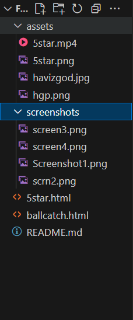

# [HVH-Humor via Hopelessness] 🎯

## Basic Details

### Team Name: [FOUR]

### Team Members

- Team Lead: KAILAS - [CEAL]
- Member 2: JEEVAN S- [CEAL]

### Project Description

We made a small project which has mainly 2 webpages, one with a Havizgod Ball catching simulator and the other with seems important but absolute weird and useless informations with a 5star button.

### The Problem (that doesn't exist)

We set out to solve the non-existent problem of catching divine balls with a bucket full of holes, only to be mocked by a bot for our inevitable failure.
we are trying to solve a game which can be won by catching all the balls that are dropped from the divine eternity but the bucket has some weird holes ....

### The Solution (that nobody asked for)

A game where you can never win, and a productivity page that offers advice so advanced, it’s completely useless.
we are trying to catch the almighty god level balls but we cannot have any option but just to hear what humiliations the hgp bot offers to us ..

## Technical Details

### Technologies/Components Used

For Software:

- html
- css
- Javascript

# Screenshots (Add at least 3)

)
This is the sample of Havizgod ball catching simulator

)
\_just a sample of hgpbot humiliating the user who failed to catch balls

)
\_just a webpage which looks like it contains helpful content but is actually filled with useless or misleading information

)
\_A hidden 5star icon which plays a sigmaboy's 5star inspiration to be useless

# Build Photos

_List out all components shown_
FOUR
│
├── 5star.html
├── ballcatch.html
├── README.md
│
└── assets/
├── 5star.mp4
├── 5star.png
├── havizgod.jpg
├── hgp.png
│
└── screenshots/
├── screen3.png
├── screen4.png
├── Screenshot1.png
└── scrn2.png

### Project Demo

# Video

[<video controls src="screenshots/rec.mp4" title="hvh-humor via hopelessness demo video"></video>]

Made with ❤️ at TinkerHub Useless Projects

